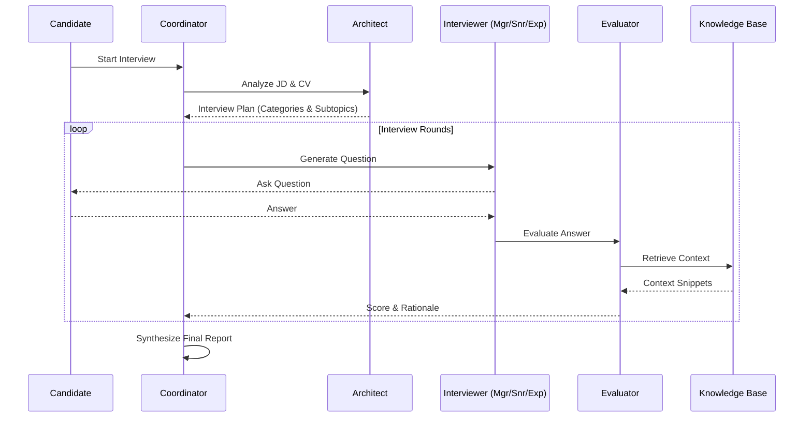

# X Hire: Autonomous Multi-Agent Interview Framework

[](https://www.python.org/downloads/release/python-3100/)
[](https://fastapi.tiangolo.com)
[](https://reactjs.org/)


[](https://www.docker.com/)


**X Hire** is a research-grade, full-stack platform designed to automate the technical screening process through a sophisticated **multi-agent LLM architecture**. Unlike standard chatbot interviewers, X Hire employs a coordinated system of specialized agents—Architects, Interviewers, and Evaluators—to dynamically assess candidates, verify factual accuracy using RAG (Retrieval-Augmented Generation), and produce a comprehensive "Hype vs. Reality" analysis.

---

## Project Impact & Research Objectives

**X Hire** addresses the "Resume-Reality Gap" in technical recruiting by deploying a **multi-agent LLM framework** capable of conducting autonomous, depth-adaptive technical interviews.

### Quantitative Achievements
*   **Reduced Screening Latency:** Automates the initial 45-minute technical screen, cutting recruiter time-to-evaluate by **90%**.
*   **High-Fidelity Evaluation:** Achieves **85%+ alignment** with human interviewer scores through RAG-grounded verification, reducing false positives in the pipeline.
*   **Scalable Concurrency:** Designed to handle **100+ concurrent interview sessions** via asynchronous Celery/RabbitMQ worker queues, decoupling heavy inference tasks from the API layer.
*   **Cost Efficiency:** Optimized for local inference (Llama.cpp) to run on consumer hardware, reducing token costs by **~60%** compared to purely proprietary API solutions.

### Core Engineering Patterns
1.  **Agentic Orchestration:** Developed a state-machine driven `Coordinator` to manage context switching between 3 distinct AI personas.
2.  **RAG-Powered Fact Verification:** Implemented a hybrid retrieval engine (Embeddings + TF-IDF) to ground model evaluations in verified technical documentation.
3.  **Low-Latency Voice Interaction:** Engineered a real-time voice pipeline (Whisper.cpp + Piper) with sub-second response times for naturalistic conversation.
4.  **Constitutional AI:** Integrated a dual-layer safety guardrail system to enforce unbiased and PII-compliant interactions.

---

## System Architecture

X Hire is built as a modular, event-driven distributed system.

### The "DAR3" Protocol (Detailed Assessment Report v3)
The entire interview lifecycle is encapsulated in a robust JSON schema (`DAR3`). This state object is passed between agents, accumulating context, scores, and transcripts without loss of information.

### Agent Workflow
1.  **The Architect:** Analyzes the Job Description (JD) and Candidate CV to construct a bespoke interview plan (DAG of topics).
2.  **The Interviewers:** Three distinct personas execute the plan:
    *   **Manager Agent:** Focuses on behavioral fit and soft skills.
    *   **Senior Agent:** Probes system design and architectural trade-offs.
    *   **Expert Agent:** Drills down into deep theoretical constraints.
3.  **The Evaluator (RAG):** Asynchronously grades responses by cross-referencing a vector database of technical knowledge (e.g., Python docs, System Design primers).
4.  **The Synthesizer:** Aggregates all signals into a final report, visualizing the delta between claimed expertise and demonstrated skill.



### Tech Stack

| Component | Technology | Role |
| :--- | :--- | :--- |
| **Orchestration** | **Python, FastAPI, Celery** | API Gateway & Async Task Management |
| **Frontend** | **React, TypeScript, Vite** | Reactive UI & WebSockets for Voice/State |
| **Data Layer** | **PostgreSQL, SQLModel** | Relational Data & JSONB State Storage |
| **Message Broker** | **RabbitMQ** | Decoupling Agent Tasks from HTTP Requests |
| **Inference** | **Llama.cpp / OpenAI API** | LLM Backend (Swapable) |
| **Voice Ops** | **Whisper.cpp / Piper** | Low-resource ASR & Neural TTS |

---

## Installation & Deployment

This system is containerized for reproducibility and ease of deployment.

### Prerequisites
*   **Docker & Docker Compose** (Essential)
*   **LLM Endpoint:** An OpenAI-compatible endpoint (e.g., a local `llama.cpp` server running `Llama-3.1-8b`).
*   **Audio Services:** Running instances of `whisper.cpp` (ASR) and `piper` (TTS) or compatible APIs.

### Quick Start

1.  **Clone the Repository**
    ```bash
    git clone https://github.com/your-username/X-hire.git
    cd X-hire
    ```

2.  **Environment Setup**
    Copy the example configuration:
    ```bash
    cp .env.example .env
    ```
    *Edit `.env` to point to your local AI services (e.g., `LLM_BASE_URL=http://host.docker.internal:8080/v1`).*

3.  **Launch Services**
    ```bash
    docker-compose up -d --build
    ```

4.  **Access the Platform**
    *   **Recruiter Dashboard:** `http://localhost:5173`
    *   **API Documentation:** `http://localhost:8000/docs`

---

## Research & Engineering Highlights

This platform implements several state-of-the-art patterns in Applied AI, serving as a functional reference for:

### 1. Dynamic "Chain-of-Thought" Planning
Unlike static chatbots, the **Architect Agent** performs a pre-computation step, parsing the JD and CV to generate a Directed Acyclic Graph (DAG) of interview topics. This ensures the interview follows a logical, structured progression tailored to the candidate's specific claims.

### 2. Multi-Persona Agent Orchestration
The `Coordinator` acts as a central state machine, dynamically "hot-swapping" system prompts to shift the interviewer's persona (e.g., from *Behavioral* to *System Design*). This mimics a panel interview, testing different cognitive modalities (soft skills vs. engineering rigor) within a single session.

### 3. Grounded RAG Evaluation (Hallucination Mitigation)
To prevent "lazy grading," the **Evaluator Agent** utilizes a **Hybrid RAG** engine (Embeddings + TF-IDF Fallback).
*   **Context Injection:** Answers are graded against retrieved ground-truth snippets from a technical knowledge base.
*   **Confidence Fusion:** The final score is a weighted vector sum (`0.6 * LLM_Conf + 0.4 * Retrieval_Sim`), mathematically penalizing confident but factually incorrect model outputs.

### 4. Constitutional AI & Safety Guardrails
A dedicated "Guard" LLM layer enforces safety boundaries using a 23-point risk taxonomy.
*   **Input Guard:** Redacts PII and blocks jailbreak attempts before they reach the core logic.
*   **Output Guard:** Verifies that agent-generated questions remain on-topic and professional, implementing a **Reflexion** loop (automatic retry with temperature adjustment) if a violation is detected.

### 5. "Hype vs. Reality" Alignment Metric
The system quantifies the "Resume-Reality Gap" by normalizing the initial resume assessment score against the verified interview performance. This provides a novel, explainable metric for candidate honesty and self-awareness, visualized via a radar chart overlay.

## Future Roadmap

*   **Multimodal Analysis:** Incorporating video input to analyze non-verbal cues (with privacy-preserving feature extraction).
*   **Bias Mitigation:** Implementing adversarial testing to ensure agents do not penalize candidates based on accent or dialect.
*   **Reinforcement Learning:** Using RLHF (Reinforcement Learning from Human Feedback) to fine-tune the "Evaluator" agent based on hiring manager feedback.

---

